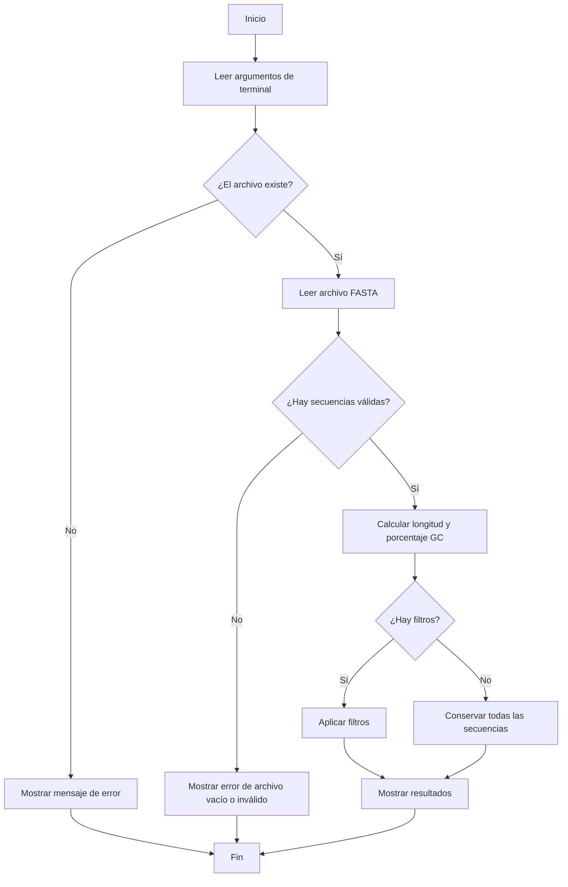

# Diseño del programa

## Descripción general

El programa `analizador.py` recibe la ruta de un archivo FASTA desde la terminal. Después lee el archivo, separa cada secuencia con su encabezado, calcula métricas básicas y muestra los resultados.

El programa también permite aplicar filtros opcionales para mostrar solo las secuencias que cumplan con una longitud mínima o un porcentaje mínimo de GC.

## Entrada

El programa recibe:

- La ruta de un archivo FASTA.
- Opcionalmente, un filtro de longitud mínima.
- Opcionalmente, un filtro de porcentaje mínimo de GC.

Ejemplos:

```bash
python src/analizador.py data/ejemplo.fasta
```

```bash
python src/analizador.py data/ejemplo.fasta --min-len 20
```

```bash
python src/analizador.py data/ejemplo.fasta --min-gc 50
```

```bash
python src/analizador.py data/ejemplo.fasta --min-len 20 --min-gc 50
```

## Salida

El programa muestra en la terminal:

- Número total de secuencias encontradas.
- Número de secuencias que pasan los filtros.
- Identificador de cada secuencia.
- Longitud de cada secuencia.
- Porcentaje de GC de cada secuencia.

## Algoritmo

1. Recibir los argumentos desde la terminal.
2. Verificar si el archivo existe.
3. Abrir el archivo FASTA.
4. Leer línea por línea.
5. Detectar encabezados que empiezan con `>`.
6. Guardar la secuencia correspondiente a cada encabezado.
7. Calcular longitud y porcentaje GC para cada secuencia.
8. Aplicar filtros si el usuario los indicó.
9. Mostrar resultados en la terminal.
10. Terminar el programa.

## Diagrama Mermaid



## Funciones principales

### `leer_fasta(ruta_archivo)`

Lee un archivo FASTA y regresa una lista de secuencias con su encabezado.

### `calcular_gc(secuencia)`

Calcula el porcentaje de bases G y C en una secuencia.

### `analizar_secuencias(secuencias)`

Calcula longitud y contenido GC para cada secuencia.

### `filtrar_resultados(resultados, min_len, min_gc)`

Filtra las secuencias según los parámetros indicados por el usuario.

### `mostrar_resultados(resultados, total_original)`

Muestra el análisis final en la terminal.

### `main()`

Controla el flujo principal del programa.